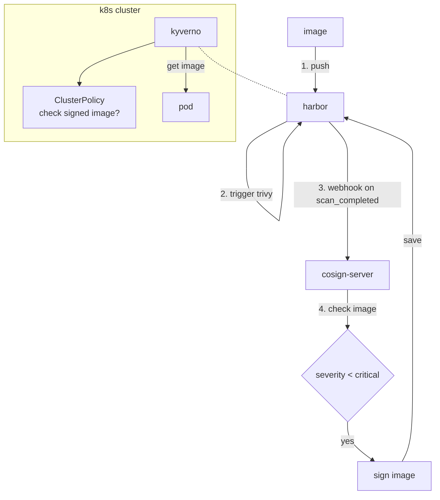

# Safer deploy in k8s 

## flow


## solutions

### config webhook in harbor and auto scan with trivy

- webhook


- auto scan


### pollute harbor with vulnerable images and trivy scan results

- pollute harbor


- webhook results


- log in webhook


- cve details: [csv_file_20260412180800.csv](assets/csv_file_20260412180800.csv)

### opt. 1: Use built-int harbor cosign prevention

- config in harbor UI


- result in k8s


### opt. 2: Use Kyverno Admission Controller

- more flexible, can customize policy
- e.g. only allow images from specific registry, or only allow signed images with specific key, etc.


## walkthrough

```bash
kind create cluster --config manifests/kind-config.yaml

cloud-provider-kind # 172.18.0.5

# /etc/hosts
# 172.18.0.5 core.harbor.domain
# 172.18.0.5 webhook.harbor.domain

helm repo add containeroo https://charts.containeroo.ch
helm upgrade --install local-path-provisioner containeroo/local-path-provisioner --version 0.0.36 --set storageClass.defaultClass=true

helm repo add ingress-nginx https://kubernetes.github.io/ingress-nginx
helm upgrade --install ingress-nginx ingress-nginx/ingress-nginx --version 4.15.1

helm repo add harbor https://helm.goharbor.io
helm upgrade --install harbor harbor/harbor --version 1.18.3 --set expose.ingress.className=nginx

k apply -f manifests/deploy
```
### in case opt. 2

```bash
helm repo add kyverno https://kyverno.github.io/kyverno/
helm repo update
helm upgrade --install kyverno kyverno/kyverno --version 3.7.1 -n kyverno --create-namespace --set features.registryClient.allowInsecure=true
k apply -f manifests/07-kyverno-policy.yaml
```

### test
```bash
chmod +x pollute-harbor.sh
./pollute-harbor.sh

k apply -f manifests/samples
```

### clean up
```bash
kind delete cluster -n meo
```