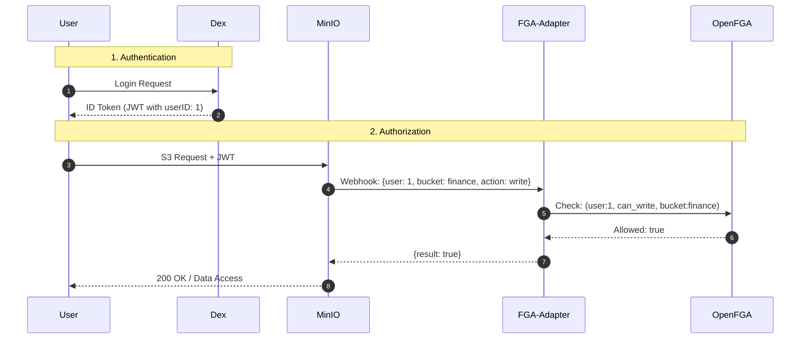

```bash
helm repo add openfga https://openfga.github.io/helm-charts
helm repo add bitnami https://charts.bitnami.com/bitnami
helm repo add dex https://charts.dexidp.io
helm repo update

helm upgrade --install postgres bitnami/postgresql \
  --set auth.postgresPassword=password \
  --set auth.database=openfga \
  --set primary.persistence.enabled=true \
  --set primary.persistence.size=5Gi

helm upgrade --install dex dex/dex -f values-dex.yaml

helm upgrade --install openfga openfga/openfga -f values-openfga.yaml

helm upgrade --install minio minio/minio --values values-minio.yaml --version 5.0.10

kubectl apply --server-side -f https://github.com/kubernetes-sigs/gateway-api/releases/download/v1.5.0/standard-install.yaml

helm install ngf oci://ghcr.io/nginx/charts/nginx-gateway-fabric --create-namespace -n nginx-gateway

```

## fga set up

```bash
# Create store
curl -X POST http://openfga.local/fga/stores -H "Content-Type: application/json" -d '{"name": "cloud"}'

# Create authorization model
curl -s -X POST http://cloud.local/fga/stores/01KMTV40183M9215QGZV7H7V2D/authorization-models \
  -H "Content-Type: application/json" \
  -d '{"schema_version":"1.1","type_definitions":[{"type":"user","relations":{}},{"type":"system","relations":{"admin":{"this":{}},"can_read":{"union":{"child":[{"this":{}},{"computedUserset":{"relation":"admin"}}]}}},"metadata":{"relations":{"admin":{"directly_related_user_types":[{"type":"user"}]},"can_read":{"directly_related_user_types":[{"type":"user"}]}}}},{"type":"bucket","relations":{"owner":{"this":{}},"can_read":{"union":{"child":[{"this":{}},{"computedUserset":{"relation":"owner"}}]}},"can_write":{"union":{"child":[{"this":{}},{"computedUserset":{"relation":"owner"}}]}},"can_delete":{"union":{"child":[{"this":{}},{"computedUserset":{"relation":"owner"}}]}}},"metadata":{"relations":{"owner":{"directly_related_user_types":[{"type":"user"}]},"can_read":{"directly_related_user_types":[{"type":"user"}]},"can_write":{"directly_related_user_types":[{"type":"user"}]},"can_delete":{"directly_related_user_types":[{"type":"user"}]}}}},{"type":"object","relations":{"owner":{"this":{}},"can_read":{"union":{"child":[{"this":{}},{"computedUserset":{"relation":"owner"}}]}},"can_write":{"union":{"child":[{"this":{}},{"computedUserset":{"relation":"owner"}}]}},"can_delete":{"union":{"child":[{"this":{}},{"computedUserset":{"relation":"owner"}}]}}},"metadata":{"relations":{"owner":{"directly_related_user_types":[{"type":"user"}]},"can_read":{"directly_related_user_types":[{"type":"user"}]},"can_write":{"directly_related_user_types":[{"type":"user"}]},"can_delete":{"directly_related_user_types":[{"type":"user"}]}}}}]}'


# 5. Bulk insert all at once (all 4 in one request)
curl -s -X POST http://cloud.local/fga/stores/01KMTV40183M9215QGZV7H7V2D/write \
  -H "Content-Type: application/json" \
  -d '{
  "writes": {
    "tuple_keys": [
      { "user": "user:ABXVVONJFKZYLOTJ9ZFG",  "relation": "can_read", "object": "bucket:uploads" },
      { "user": "user:9ET3SDNY8UU6E7FRBEL4",    "relation": "owner",    "object": "bucket:uploads" },
      { "user": "user:ci-bot", "relation": "can_write","object": "object:uploads/deploy.zip" },
      { "user": "user:ops",    "relation": "admin",    "object": "system:minio" }
    ]
  }
}'

# ── Revoke / delete a tuple ───────────────────────────────────────────────────
# Same endpoint, swap "writes" → "deletes"
curl -s -X POST http://cloud.local/fga/stores/01KMTV40183M9215QGZV7H7V2D/write \
  -H "Content-Type: application/json" \
  -d '{
  "deletes": {
    "tuple_keys": [
      { "user": "user:alice", "relation": "can_read", "object": "bucket:photos" }
    ]
  }
}'

# ── Verify a tuple exists ─────────────────────────────────────────────────────
curl -s -X POST http://cloud.local/fga/stores/01KMTV40183M9215QGZV7H7V2D/check \
  -H "Content-Type: application/json" \
  -d '{ "tuple_key": { "user": "user:alice", "relation": "can_read", "object": "bucket:photos" } }'

# ── List all tuples in the store ──────────────────────────────────────────────
curl -s http://cloud.local/fga/stores/01KMTV40183M9215QGZV7H7V2D/read \
  -H "Content-Type: application/json" \
  -d '{}'

```