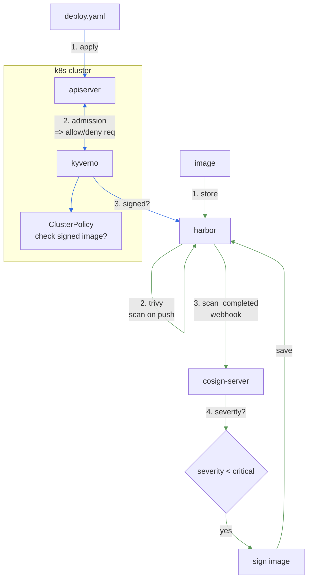

# Safer deploy in k8s

## flow



## solutions

> **[survey.md](survey.md)**

### config webhook in harbor and auto scan with trivy

- webhook
  

- auto scan
  

### pollute harbor with vulnerable images and trivy scan results

- pollute harbor
  

- webhook results
  

- log in webhook
  

- cve details: [csv_file_20260412180800.csv](assets/csv_file_20260412180800.csv)

### opt. 1: Use built-int harbor cosign prevention

- config in harbor UI
  

- result in k8s
  

### opt. 2: Use Kyverno Admission Controller

- more flexible, can customize policy
- e.g. only allow images from specific registry, or only allow signed images with specific key, etc.


## walkthrough

```bash
kind create cluster --config manifests/A/kind-config.yaml
kind create cluster --config manifests/B/kind-config.yaml

cloud-provider-kind # 172.18.0.5

# /etc/hosts
# 172.18.0.5 core.harbor.domain
# 172.18.0.5 webhook.harbor.domain

# helm repo add containeroo https://charts.containeroo.ch
# helm upgrade --install local-path-provisioner containeroo/local-path-provisioner --version 0.0.36 --set storageClass.defaultClass=true

helm repo add ingress-nginx https://kubernetes.github.io/ingress-nginx
helm upgrade --install ingress-nginx ingress-nginx/ingress-nginx --version 4.15.1

helm repo add harbor https://helm.goharbor.io
helm upgrade --install harbor harbor/harbor --version 1.18.3 --set expose.ingress.className=nginx

k apply -f manifests/deploy
```

### in case opt. 2

```bash
helm repo add kyverno https://kyverno.github.io/kyverno/
helm repo update
k create ns app-ns
helm upgrade --install kyverno kyverno/kyverno --version 3.7.1 -n app-ns -f manifests/values/kyverno.yaml
k apply -f manifests/A/07-kyverno-policy.yaml
```

### test

```bash
chmod +x pollute-harbor.sh
./pollute-harbor.sh

k apply -f manifests/samples
```

### clean up

```bash
kind delete cluster -n meo
kind delete cluster -n app
```

### multi-tenant (bonus)

```bash
helm install cert-manager oci://quay.io/jetstack/charts/cert-manager --version v1.19.2 --namespace cert-manager --create-namespace --set crds.enabled=true

k apply -f https://raw.githubusercontent.com/metallb/metallb/v0.15.3/config/manifests/metallb-native.yaml

sed -E "s|172.19|$(docker network inspect -f '{{range .IPAM.Config}}{{.Gateway}}{{end}}' kind | sed -E 's|^([0-9]+\.[0-9]+)\..*$|\1|g')|g" manifests/A/metalb.yaml | k apply -f -

helm upgrade --install kamaji clastix/kamaji --namespace kamaji-system --create-namespace --set 'resources=null' --version 0.0.0+latest

```
