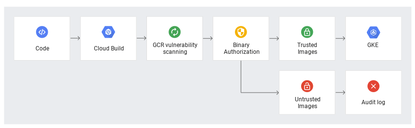

# Container Image Security in Amazon EKS

> https://docs.aws.amazon.com/eks/latest/best-practices/image-security.html

- Vulnerability scanning on CI/CD is required due to the evolving nature of security threats. Automated scanning tools and registries (e.g., ECR) facilitate ongoing risk assessment.
- Image signing mechanisms ensure authenticity and integrity. Cryptographic signatures are validated during image pull and deployment phases.
- Policy Enforcement via Admission Controllers. Kubernetes admission controllers enforce security policies at deployment time. This mechanism acts as a final security gate before workloads are admitted into the cluster.
- Trusted Image Sources or Registry Security (Amazon ECR). These controls protect image storage and distribution channels.

# Secure Build & Deploy with Cloud Build, Artifact Registry and GKE

> https://codelabs.developers.google.com/secure-build-deploy-cloud-build-ar-gke

- Scanning (Automated, On-Demand, CI/CD Pipeline). Perform vulnerability scanning build in pipelines or on demand, or let Registry do it on push.
- Image Signing. Sign container images using tools like Cosign to ensure provenance and integrity.
- Admission Control Policies (Vulnerability Enforcement). Enforce policies to allow deployment of signed images or from trusted sources (eg. gcr.io).

# Summary

Container image security relies on a layered approach spanning build, registry, and deployment phases.

- Continuous Scanning Images (CI/CD, On-Demand, Registry-Integrated): self set up or use registry's scanning service
- Integrity & Trust Image (Signing): self sign or cloud provider's signing service
- Policy Enforcement (Admission Controllers): allow to configure
- Trusted Registries (Private Registries)

> **_Overall flow: Scan -> Sign -> Enforce -> Deploy securely_**
